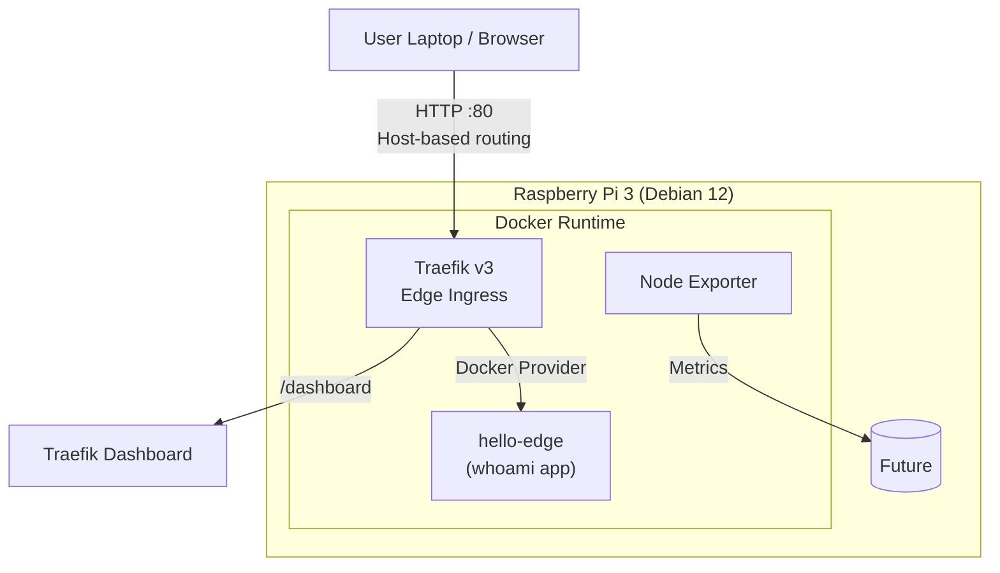

## 🚀 Project Overview

This project documents the design and implementation of a **lightweight edge platform** built on a Raspberry Pi 3, inspired by modern Platform Engineering and SRE practices.

The goal is not just to run containers — but to build:
- A **reliable edge platform**
- With **observability baked in**
- Fully **documented**
- And easy to reproduce

---

## 🎯 Objectives

- Build a production-inspired edge platform on Raspberry Pi 3
- Run containerized workloads using Docker
- Implement monitoring and observability
- Expose services securely
- Maintain Git-driven documentation

---

## 🧠 Architecture Overview

**Core components:**
- Raspberry Pi (Edge Node)
- Docker & Docker Compose
- Reverse Proxy (Traefik)
- Monitoring (Prometheus + Grafana)
- Logging (future)
- GitHub + Hugo for documentation

> Diagram will be added once the platform is stable.

---

## 🧰 Hardware & Software

### Hardware
- ✅ Raspberry Pi 3 Model B
- ✅ ARMv8 / 64-bit
- ✅ Debian 12 (Bookworm)
- ⚠️ 1 GB RAM
- ⚠️ 16 GB SD card
- ⚠️ 100 Mbps Ethernet

### Software
- Raspberry Pi OS (64-bit)
- Docker
- Docker Compose
- Traefik
- Prometheus
- Grafana

---

## 🛠️ Build Phases

### Phase 0 - Critical Fixes (Before Containers)
- Increase swap from 512 MB to 2 GB (mandetory on Pi 3)
- Reduce GPU memory (headless optimization)

### Phase 1 – Base OS & Access
- Flash Raspberry Pi OS
- Enable SSH
- Secure access

### Phase 2 – Container Platform
- Install Docker
```shell
curl -fsSL https://get.docker.com | sh
sudo usermod -aG docker $USER
newgrp docker
```
- Validate container runtime
```shell
docker run hello-world
```
- Install Docker Compose plugin
```shell
sudo apt install docker-compose -y
docker-compose version
```
- Define compose structure
```shell
mkdir -p ~/edge-platform/{infra,apps,observability,docs}
```

```text
edge-platform/
├── infra/              # reverse proxy, networking
├── observability/      # prometheus, grafana
├── apps/               # workloads (later)
├── docs/               # local docs / diagrams
```

### Phase 3 – Networking & Security
- Reverse proxy
  
  For this we use Traefik container.
  
  Traefik is:
    - Lightweight
    - ARM friendly
    - Production-relevent
  
  #### Create Traefik stack
```shell
cd ~/edge-platform/infra
mkdir traefik && cd traefik
nano docker-compose.yml
```

```yaml
version: "3.9"
services:
  traefik:
    image: traefik:v3.0
    container_name: traefik
    command:
      - "--api.dashboard=true"
      - "--api.insecure=true"  # Changed to true for easier local access
      - "--providers.docker=true"
      - "--providers.docker.exposedbydefault=false"
      - "--entrypoints.web.address=:80"
    ports:
      - "80:80"
    volumes:
      - /var/run/docker.sock:/var/run/docker.sock:ro
    networks:
      - traefik
    labels:
      - "traefik.enable=true"
      - "traefik.http.routers.traefik.rule=Host(`traefik.pi`)" 
      - "traefik.http.routers.traefik.service=api@internal"
      - "traefik.http.routers.traefik.entrypoints=web"  # Added entrypoint
networks:
  traefik:
    name: traefik
```

```shell
docker compose up -d
docker ps
```
- TLS (later)
- Service exposure
Test in browser:
```text
http://traefik.pi/dashboard/
```

If above not accessible via your PC or Laptop browser, we need to add the host configurations. Follow the below instructions.

***Linux / macOS***
```shell
sudo nano /etc/hosts
```

***Windows (Run Notepad as Admin)***
```txt
C:\Windows\System32\drivers\etc\hosts
```

Add:
```text
<raspberry-pi-ip>   traefik.pi
```

Save--> close --> restart browser

Now test:
```text
http://traefik.pi/dashboard/
```

### Phase 4 – Observability
- Create observability directory
```shell
cd ~/edge-platform
mkdir -p observability/node-exporter
cd observability/node-exporter
```
- Metrics collection
  For metrics collection we deploy node-exporter docker container.

```shell
nano docker-compose.yml
```

```yaml
version: "3.9"

services:
  node-exporter:
    image: prom/node-exporter:latest
    container_name: node-exporter
    restart: unless-stopped
    pid: host
    command:
      - '--path.rootfs=/host'
    volumes:
      - '/:/host:ro,rslave'
    ports:
      - "9100:9100"
```
Start Node Exporter
```shell
docker-compose up -d
docker ps
```
Verify Metrics Endpoint
```text
http://<pi-ip>:9100/metrics
```
You should see ***raw Prometheus metrics text***.
- Dashboards
- Alerts (future)

#### System Observability – Node Exporter

To establish baseline observability without overloading the device, Prometheus Node Exporter was deployed as the first monitoring component. This provides real-time visibility into CPU, memory, disk, and network metrics while maintaining a minimal resource footprint suitable for edge devices.

> We’ll deploy a tiny edge workload and expose it cleanly through Traefik, exactly how you’d expect in a real edge platform-engineering setup.

### 🚀 First Edge Workload

“Hello Edge” app behind Traefik

***Goal:***
- Simple container
- No heavy frameworks
- Routed via Traefik
- Accessible via hostname
- Zero ports exposed

***Create App Directory***
```shell
cd ~/edge-platform
mkdir -p workloads/hello-edge
cd workloads/hello-edge
```

***Create docker-compose.yaml***
```shell
nano docker-compose.yml
```

```yaml
version: "3.9"
services:
  hello-edge:
    image: traefik/whoami
    container_name: hello-edge
    restart: unless-stopped
    labels:
      - "traefik.enable=true"
      - "traefik.http.routers.hello-edge.rule=Host(`hello-edge.pi`)"
      - "traefik.http.routers.hello-edge.entrypoints=web"
      - "traefik.http.services.hello-edge.loadbalancer.server.port=80"
    networks:
      - traefik

networks:
  traefik:
    external: true  # Use external since traefik network already exists
```

***Deploy the Workload***
```shell
docker-compose up -d
docker ps
```

***Update Local DNS (Laptop/Desktop)***
Linux/macOS:
```shell
sudo nano /etc/hosts
```

Windows:
```text
C:\Windows\System32\drivers\etc\hosts
```

Add:
```text
<PI-IP> hello-edge.pi
```

***Access the app***
Open browser:
```text
http://hello-edge.pi
```

You shoul see output like:
```yaml
Hostname: hello-edge
IP: 172.20.0.x
Headers:
  Host: hello-edge.localhost
  X-Forwarded-For: ...
```

#### First Edge Workload Deployment

A lightweight containerized workload was deployed behind Traefik to validate ingress routing, service discovery, and network isolation on the edge platform. The workload uses Traefik's `whoami` image to demonstrate request flow, headers, and routing behavior without introducing application complexity.

---

# 🧱 Architecture diagrams

First Edge Workload Architecture:
```scss
User
 └── HTTP(S)
      └── Traefik (Edge Ingress)
            └── hello-edge (sample app)
```

🏗️ Indushomelab Edge Platform – Architecture Diagram v1

🎯 Purpose of v1
- Single-node Edge Platform on Raspberry Pi 3
- Central ingress using Traefik
- Containerized edge workloads
- Clear separation: Infra / Workloads / Observability
- Designed to scale later (multi-node, TLS, auth, GitOps)

📐 Architecture Diagram (Logical View)


> Architecture Diagram v1 – Single-node Edge Platform using Traefik as ingress, running on Raspberry Pi 3 with containerized edge workloads.

#### 🧭 Traffic Flow:
1. User accesses http://hello-edge.pi
2. DNS resolves to Raspberry Pi IP
3. Request hits Traefik on port 80
4. Traefik matches Host rule
5. Traffic forwarded to hello-edge
6. Response returned via Traefik

---

## 📸 Gallery

Images and diagrams will be added as the project progresses.

---

## 📘 Lessons Learned (living section)

### 📈 Increasing Swap Space on Raspberry Pi (Edge Platform Prerequisite)

**Why Swap Matters on Edge Devices**

The Raspberry Pi 3 is constrained by 1 GB of RAM, which is insufficient for:

- Docker daemon
- Multiple containers
- Observability tooling (Prometheus, Grafana)

Swap acts as a pressure relief valve, preventing:

- OOM (Out-Of-Memory) kills
- Random container crashes
- System lockups under load

> ⚠️ Swap is not a performance booster — it is a stability mechanism.

For this edge platform, increasing swap is mandatory.

**Current System State**
```shell
free -h
```

Typical output before change:
```text
              total        used        free
Mem:           982Mi        380Mi        120Mi
Swap:          512Mi        138Mi        374Mi
```

The default 512 MB swap is insufficient for containerized workloads.

**Target Configuration**
Setting		Value
Swap size	2 GB
Swap file type	File-based
Use case	Docker + observability

### Step-by-Step: Increase Swap to 2 GB

**1️⃣ Disable current swap**
```shell
sudo dphys-swapfile swapoff
```
**2️⃣ Edit swap configuration**
```shell
sudo nano /etc/dphys-swapfile
```
Locate:
```yaml
CONF_SWAPSIZE=512
```

Change to:
```yaml
CONF_SWAPSIZE=2048
```

Save and exit (CTRL+O, ENTER, CTRL+X).

**3️⃣ Recreate the swap file**
```shell
sudo dphys-swapfile setup
```

This recreates the swap file with the new size.

**4️⃣ Re-enable swap**
```shell
sudo dphys-swapfile swapon
```
**5️⃣ Verify swap is active**
```shell
free -h
```

Expected output:
```text
              total        used        free
Mem:           982Mi        380Mi        120Mi
Swap:          2.0Gi        0Mi          2.0Gi
```
**Validation Checks**
```shell
swapon --show
```

You should see:
```text
NAME       TYPE SIZE USED PRIO
/var/swap  file 2G   0B   -2
```
### Operational Notes (Important)

**⚠️ SD Card Wear**

- Swap increases write activity
- Acceptable for homelab / edge experiments
- Not recommended for heavy production writes

**🧠 Memory Behavior**

- Linux will prefer RAM first
- Swap is used only under pressure
- Prevents Docker from crashing silently

> We deliberately increased swap to 2 GB to prioritize platform stability over raw performance, acknowledging edge constraints while enabling realistic container workloads.

---

## 🧪 Platform Constraints

This platform intentionally runs on a Raspberry Pi 3 with limited CPU, memory, and storage to simulate real-world edge constraints.

Design decisions prioritize:
- Low memory footprint
- Minimal container count
- Clear service ownership
- Observability without over-provisioning

---

## 🔗 References

- Docker documentation
- Prometheus
- Grafana
- Platform Engineering concepts

