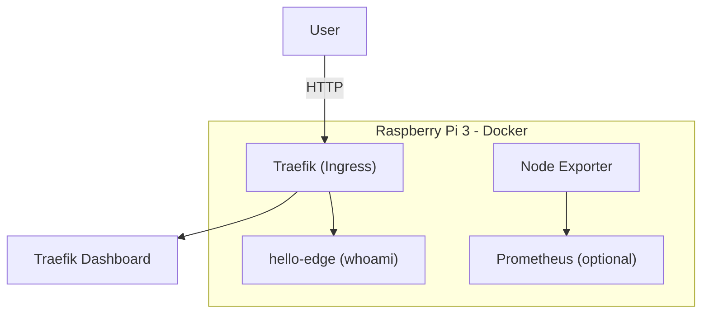

## 🚀 Project Overview

This project captures a practical, reproducible edge platform built on a Raspberry Pi 3 Model B. It demonstrates platform-oriented practices (ingress, observability, minimal workloads) while remaining lightweight enough for constrained edge hardware.

TL;DR: A single-node, container-based edge platform using Docker + Traefik for ingress and Prometheus/Grafana for observability. Designed for reproducibility and learning, not for production scale.

---

## Table of contents

- Overview
- Goals
- Hardware & Software
- Quickstart (commands)
- Architecture
- Networking & Ingress (Traefik)
- Observability (Node Exporter, Prometheus, Grafana)
- Example workload (whoami)
- Optimization & Swap
- Logging & Persistence
- Security, TLS & Limitations
- Next steps
- References

---

## 🎯 Goals

- Build a production-inspired, reproducible edge platform on Raspberry Pi 3
- Run and route containerized workloads using a lightweight ingress
- Provide minimal observability while conserving resources
- Document the steps so the platform can be recreated via Git/Hugo

---

## 🧰 Hardware & Software

Hardware
- Raspberry Pi 3 Model B (1 GB RAM, 16 GB+ SD recommended)

Software (tested / recommended)
- Raspberry Pi OS (64-bit, Debian 12)
- Docker (Engine + Compose plugin)
- Traefik (edge ingress)
- Prometheus + Grafana (observability)
- Prometheus Node Exporter (metrics)

Notes: the Pi 3 is resource constrained — design choices below prioritize stability and low footprint.

---

## Quickstart — Minimal commands

Run these on the Pi after flashing the OS and enabling SSH.

```bash
# install Docker
curl -fsSL https://get.docker.com | sh
sudo usermod -aG docker $USER
newgrp docker

# install docker compose plugin (Debian)
sudo apt update && sudo apt install -y docker-compose

# project layout
mkdir -p ~/edge-platform/{infra,workloads,observability,docs}
cd ~/edge-platform
```

---

## Architecture (single-node logical view)

- Single Raspberry Pi running Docker as the host runtime
- Traefik acts as the edge ingress and router for host-based routing
- Observability: Node Exporter → (Prometheus) → Grafana
- Workloads run as regular containers behind Traefik

Logical traffic flow:
1. Client → Traefik (port 80)
2. Traefik matches host rule and proxies to container
3. Metrics scraped from Node Exporter by Prometheus

Mermaid diagram (logical):



---

## Networking & Ingress (Traefik)

Use Traefik as the lightweight ingress. For local/homelab use, enable the dashboard only on the local network and avoid `--api.insecure=true` on any remotely accessible device.

Minimal docker-compose for Traefik (infra/traefik/docker-compose.yml):

```yaml
version: '3.9'
services:
  traefik:
    image: traefik:v3.0
    restart: unless-stopped
    ports:
      - '80:80'
    volumes:
      - /var/run/docker.sock:/var/run/docker.sock:ro
    command:
      - --providers.docker=true
      - --providers.docker.exposedbydefault=false
      - --entrypoints.web.address=:80
      - --api.dashboard=true
    networks:
      - traefik
networks:
  traefik:
    name: traefik
```

Notes:
- For development you can access the dashboard locally; for production, secure the dashboard with authentication and enable TLS/ACME.
- Traefik will pick up containers that are labeled `traefik.enable=true`.

Host file example (on your laptop) to resolve hostnames used in examples:

```text
<PI-IP> hello-edge.pi traefik.pi
```

---

## Observability

Start small: deploy Prometheus Node Exporter to expose machine metrics. If you later add Prometheus and Grafana, keep retention short to limit storage.

node-exporter compose (observability/node-exporter/docker-compose.yml):

```yaml
version: '3.9'
services:
  node-exporter:
    image: prom/node-exporter:latest
    restart: unless-stopped
    pid: host
    command: ['--path.rootfs=/host']
    volumes:
      - '/:/host:ro,rslave'
    ports:
      - '9100:9100'
```

Verify:

```text
http://<PI-IP>:9100/metrics
```

Prometheus/Grafana: run them only if you can allocate disk for time-series data. Consider remote write or short retention to avoid filling the SD card.

---

## Example workload — hello-edge

This demonstrates host-based routing with Traefik using the `traefik/whoami` image.

workloads/hello-edge/docker-compose.yml:

```yaml
version: '3.9'
services:
  hello-edge:
    image: traefik/whoami
    restart: unless-stopped
    labels:
      - traefik.enable=true
      - traefik.http.routers.hello-edge.rule=Host(`hello-edge.pi`)
      - traefik.http.routers.hello-edge.entrypoints=web
      - traefik.http.services.hello-edge.loadbalancer.server.port=80
    networks:
      - traefik
networks:
  traefik:
    external: true
```

Deploy:

```bash
cd ~/edge-platform/infra/traefik && docker compose up -d
cd ~/edge-platform/workloads/hello-edge && docker compose up -d
```

Open `http://hello-edge.pi` (or use the Pi IP and Host header) to validate routing.

---

## Optimization & Swap

On a Pi 3, increase swap to improve stability when running Docker and observability tooling. Swap reduces OOM risk at the expense of SD card wear.

Quick steps:

```bash
sudo dphys-swapfile swapoff
sudo sed -i 's/CONF_SWAPSIZE=.*/CONF_SWAPSIZE=2048/' /etc/dphys-swapfile
sudo dphys-swapfile setup
sudo dphys-swapfile swapon
free -h
```

Operational notes:
- Use swap to improve reliability, not performance.
- Consider using an external SSD or overlayfs for more write endurance if you plan to run Prometheus long-term.

---

## Logging & Persistence

Centralized logging on a Pi should be lightweight. Recommended approach for homelab:

- Loki + Promtail: lightweight, integrates with Grafana, and is designed for short-term retention.
- Alternatively, forward logs to a central server (if available) to avoid local disk pressure.

Minimal Promtail configuration will tail container logs and push to a Loki instance running on another host or locally (if you can spare disk).

---

## Security, TLS & Limitations

Security recommendations:
- Do not enable Traefik dashboard insecurely on WAN-accessible networks.
- Use local DNS or /etc/hosts for name resolution in homelab setups.
- For TLS: use Traefik ACME when you have a routable domain, or use a local CA (mkcert) for development.

Limitations of this design:
- Single-node: no HA, no scheduler beyond Docker
- Storage: SD cards have limited endurance
- Compute: Pi 3 CPU and RAM restricts workload complexity

---

## Next steps / Roadmap

Short term:
- Add Prometheus + Grafana with minimal retention and dashboards for Node Exporter
- Add Loki + Promtail for logs (optional)
- Harden Traefik configuration (basic auth)

Medium term:
- Migrate to Pi 4 or multi-node cluster for resilience
- Introduce GitOps for workload deployments

---

## Conclusion

This repo documents a practical single-node edge platform suitable for learning and homelab experimentation. It shows how to run container workloads behind an ingress, collect system metrics, and operate within the constraints of edge hardware.

---

## References

- Docker: https://docs.docker.com
- Traefik: https://doc.traefik.io/traefik/
- Prometheus: https://prometheus.io
- Grafana: https://grafana.com

## Appendix — Helpful host entries

Add to your pc/laptop's hosts file while testing:

```text
<PI-IP> hello-edge.pi traefik.pi
```
<PI-IP> hello-edge.pi

